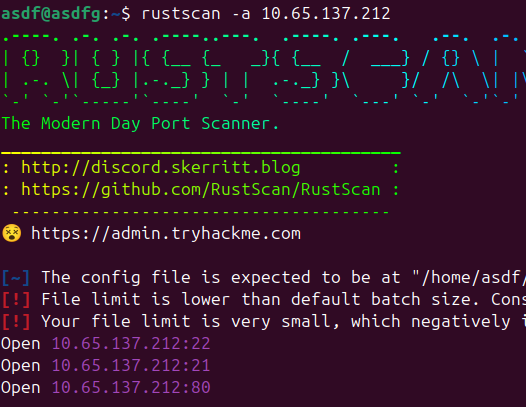
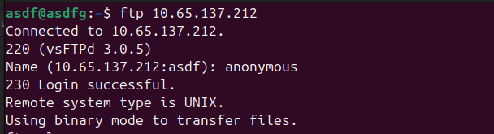
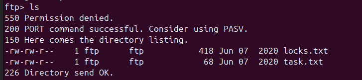
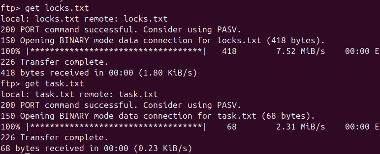
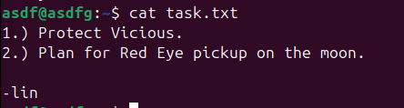
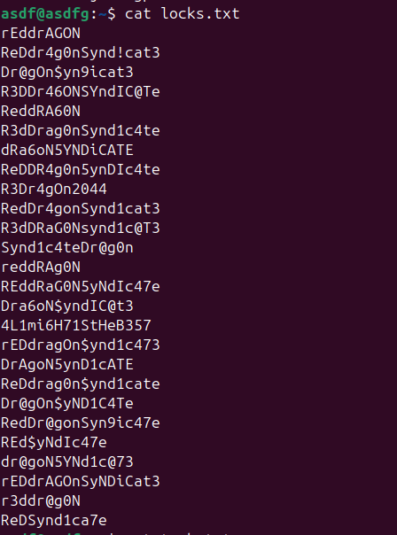
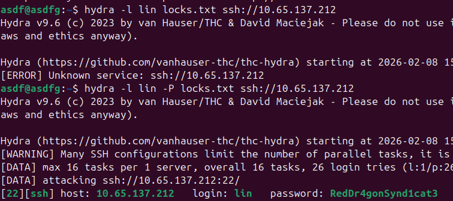
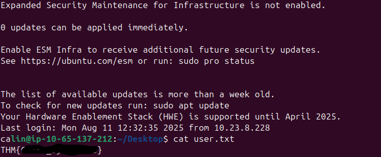
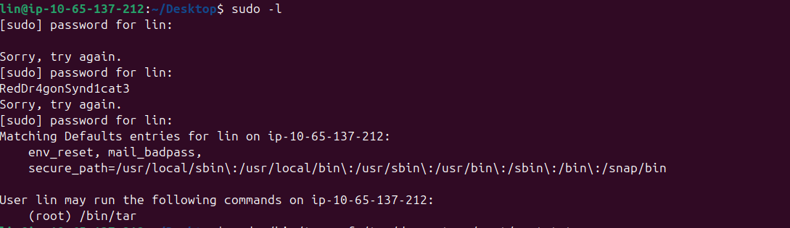
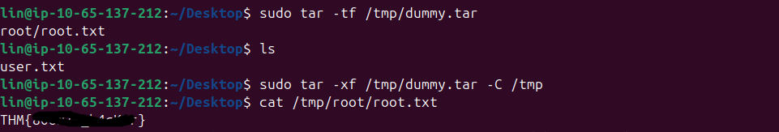

# TryHackMe: Bounty Hacker Writeup

Welcome! Today we are diving into the **Bounty Hacker** room on TryHackMe. This machine is rated as **Easy**, making it a perfect playground for practicing basic enumeration and privilege escalation techniques.

----------

## 1. Enumeration

### Port Scanning

We'll start by identifying open ports. I used `rustscan` for speed, but `nmap` works just as well.

**Open Ports Identified:**

-   **21 (FTP):** File Transfer Protocol.
    
-   **22 (SSH):** Secure Shell.
    
-   **80 (HTTP):** Web Server.
    

### Web Server (Port 80)

I began by exploring the web server. But didn't find any hidden paths or interesting vulnerabilities. Time to move on.

----------

## 2. FTP Exploration

The FTP server caught my eye because it allows **anonymous login**. If we type any login, it throws us «530 This FTP server is anonymous only».

Once inside, I listed the files and found two interesting ones:

1.  `locks.txt`
    
2.  `task.txt`

I downloaded both to my local machine for further analysis.

### Analyzing the Files

-   **task.txt:** This file contained a simple to-do list. Most importantly, it was signed by **"lin"**. Now we have a potential username. Moreover, this is a flag for one of THM's tasks.
    
-   **locks.txt:** This file looked like a wordlist of passwords.

----------

## 3. Initial Access

### SSH Brute Force

With a potential username (`lin`) and a list of passwords (`locks.txt`), we can attempt to brute-force the SSH service using **Hydra**.

**Bingo!** We found the credentials:

-   **Username:** `lin`
    
-   **Password:** `RedDr4gonSynd1cat3`
    
Moreover, these are flags for THM's tasks: `RedDr4gonSynd1cat3` and `SSH`.

I logged in via SSH and successfully captured the user flag:

----------

## 4. Privilege Escalation

Now, we need to escalate our privileges to root. I checked the allowed `sudo` commands for our current user:

The output showed that the user `lin` can run `/bin/tar` as **root** without a password.

### Exploiting Tar

Then we simply can exploit it by using basic linux techniques.

----------

## Conclusion

This was a fun, straightforward room that reinforces the importance of checking for anonymous access and misconfigured sudo permissions.

**Happy Hacking!**

